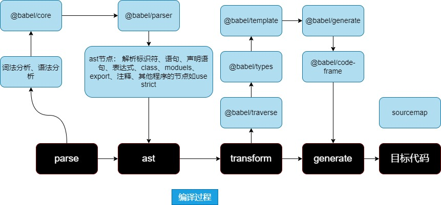

# babel-plugin-idea

## 关于babel 

babel常见的用于代码的es6语法的转换、也用于处理ts等其他语法的转义。也可以用来处理编译过程中代码生成的ast树(token组合)。

ast树本质就是代码的`抽象tree`的结构，我们可以通过这个抽象节点的深度遍历然后使用visit函数访问，通过@babel/traverse等包的api的处理，我们可以定制化我们的业务需求，将其封装成plugin或loader，生成你需要的定制化代码，比如你可以实现storybook的文档注释直接解析成一个文档对象，实现自动的数据埋点、根据ast结构优化js的编译优化等。

> babel的执行原理：

> 分析babel ast节点的工具

> 常见的ast节点
  - 标识符 indentifer
  - 字面量 literal
  - 语句 statement
  - 声明语句 Declaration
  - 表达式 Expression
  - class、 module、file、program、 directive、comment

> babel包
### 集成包

@babel/cli  
@babel/preset-env
@babel/preset-typescipt
### 工具包
@babel/parser  用于生成ast语法树
@babel/core     babel核心的api，主要用于转换的基础
@babel/generator 生成最终代码  sourceMap
@babel/code-frame 代码定位
@babel/runtime    运行时库，用于重复导入复用函数， 使用@babel-plugin-transfrom-runtime
@babel/template    批量更新修改节点
@babel/traverse   遍历更新节点
@babel/types     构建ast树，静态类型

> 常用的操作visitor对象的方法：

  - path.traverse(visitor, state)

  - get(key)  获取某个属性的path

> 内置功能

  syntax plugin 用于在写插件的时候解析ts、jsx、flow
  transfrom plugin  用于语言特性的转换、ts、jsx

  preset 工具集
  helper 将通用的ast操作逻辑复用
  babel-runtime 会打包构建产物中、corejs、regenergator、helper

> preset 根据目标语言版本来指定一系列插件

  如果代码本身就没有es6，需要指定版本，减轻runtime包体积，为了适配浏览器版本、node、electron，通过babel7 @babel/compat-data维护了特性与目标环境的映射关系

  可以通过@babel/preset-env指定usage自动按需引入polyfill、target设置目标环境

> helper -> runtime

usage自动引入，如果每个文件都去引用，会冗余helper、polyfill污染全局环境

解决方法： `模块化`

**babel8解决方案**
@babel/plugin-transforo-runtime， 但是helper不支持targets过滤  

**babel8解决方案**
@babel/plugin-transform-runtime 不支持根据 targets 的过滤，和 @babel/preset-env 配合时有问题，这个在 babel8 中得到了解决。babel8 提供了很多 babel polyfill 包，支持了 polyfill provider 的配置，而且还可以选择注入方式。不再需要 @babel/plugin-transform-runtime 插件了。